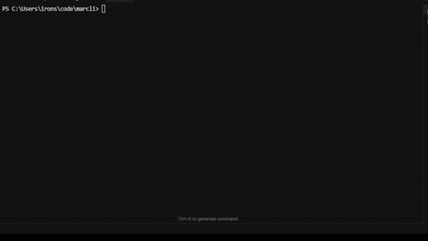

# marcli 💕

Hey there! ✨ Welcome to **marcli** - the cutest CLI tool for Marcy.cloud! 🎀



This is a super cute Terminal UI (a cutiepie TUI if you will *wink*) app that represents my personal CLI knowledge, built from the ground up with lots of love! 💖 It's got everything you need - a fancy TUI for when you want to explore, and direct CLI commands for when you're being that hacker girl from the 80's on the terminal! 💪

> **Note** 💅: This style of working (naming a CLI after myself as an internal marketing tool) was originally developed by me, Marcy, during my time at RealEyes Media while working for NBC Sports! ARE YOU IMPRESSED? While none of the actual code from the RealEyes Media MarCLI is present in this repo (we've come a long way, baby! ✨), the philosophy and approach live on here with lots of love! 💖  
>  
> And of course, **special thank you to Josh Sprow** for *all* the coding help, all the time — you make everything better! 💖

## What's Inside 🎀

- **Cutiepie TUI** 🎨 - An interactive menu that's just adorable!
- **CLI Commands** 💅 - Run commands directly from the terminal
- **Version Tracking** ✨ - We keep track of builds because we're organized like that!
- **Cross-Platform Builds** 🌈 - Works everywhere because we're inclusive!

## Commands 💅

Here are all the cute commands available:

- `go-echo` - Echo using pure Go (no external processes) - so clean! 💕
- `ps-echo` - Echo using PowerShell - so powerful! 💪
- `bash-echo` - Echo using bash/sh - classic and cute! 🎀
- `build` - Build for all platforms (macOS, Linux, Windows) and install to PATH - building everything with love! 💖
- `version` - Show version and build number - so organized! ✨
- `-v` / `--version` - Quick version check (aliases for `version`) - we're so flexible! 💅
- `mega-combine` - Select and combine video files into ProRes for DaVinci Resolve on iPad - so efficient! 🎨 See [cmd/mega-combine-README.md](cmd/mega-combine-README.md) for details! 💕

## Quick Start 💖

Just run `marcli` with no args to see the cutie pie TUI, or use commands directly:

```bash
marcli mega-combine   # Combine videos for DaVinci Resolve! 🎨
marcli version        # See the version (so fancy!)
marcli build          # Build everything! 💪
marcli go-echo        # Try a command! 🎀
```

Enjoy! 💕
